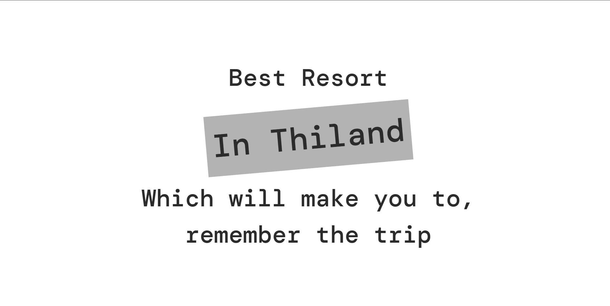
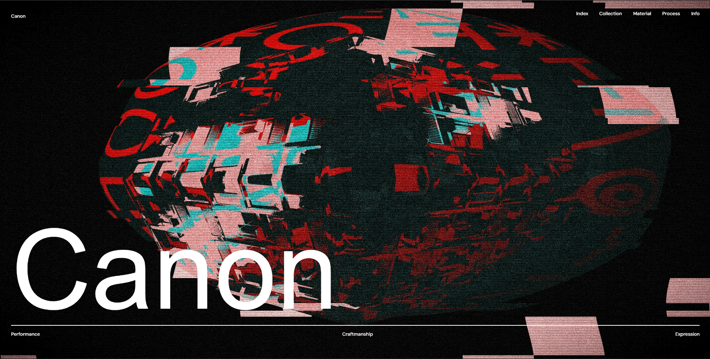
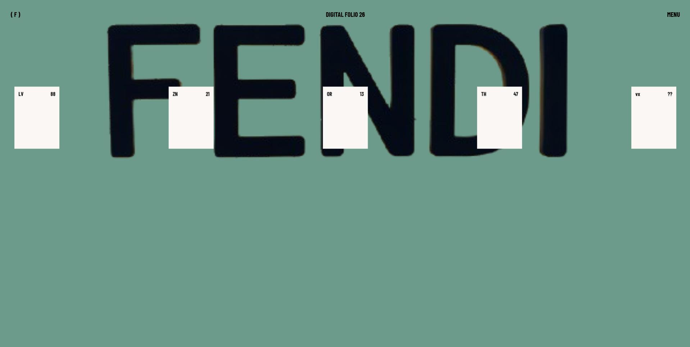
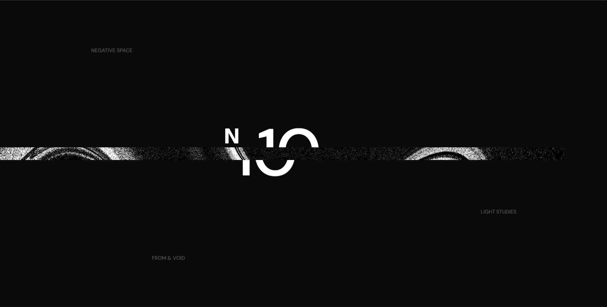

# UI-1

A GSAP-based landing page that animates the text and image into the horizontal direction.

## 🖼 UI Preview

## 🔗 Live Demo
https://animatedhorizontalscrollinggsap.vercel.app/

## 🎥 Loom Walkthrough
https://www.loom.com/share/0fb89d4373384f32883cfd10fe8866f0

# UI-2

A GSAP-based landing page that reveals the content with the timeline.

## 🖼 UI Preview

## 🔗 Live Demo
https://landingpagereveal1.vercel.app/

## 🎥 Loom Walkthrough
https://www.loom.com/share/e7072181e6f04ad0a5d8a0db5905c195

# UI-3

A GSAP-based landing page that reveals the content with the timeline. This allows you play with words and moving sections at the same time.

## 🖼 UI Preview

## 🔗 Live Demo
https://shufflethedeckheroanimation.vercel.app/

# UI-4

A GSAP-based reveal animation which reveals section and text one by one based on timeline.

## 🖼 UI Preview

## 🔗 Live Demo
https://gsap-animation-reveal-day-4.vercel.app/